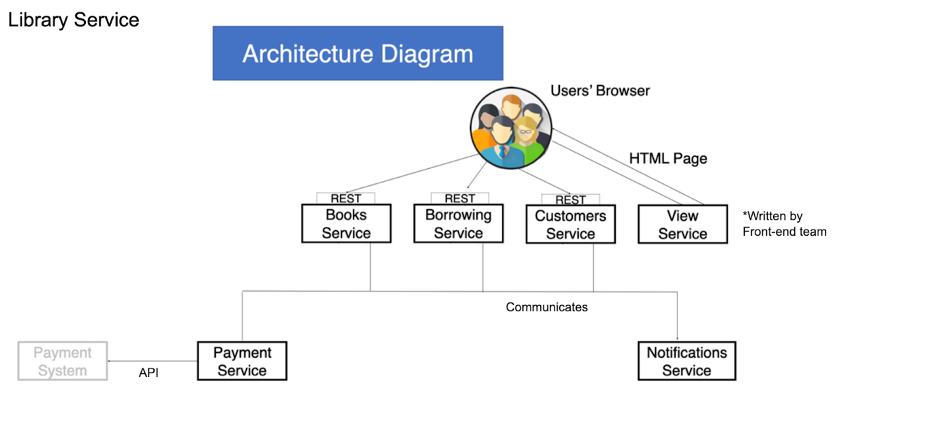

# Library Service

Django project for a management system for book borrowing

* Added and manage books
* Added borrowing
* Added payments for borrowing
* Notifications for borrowing in telegram chat

## Architecture library service

## Installing / Getting started
* git clone https://github.com/AlenOl/library-service-api
* cd library-service-api

> For Mac and Linux:
> * python3 -m venv venv
> * source venv/bin/activate

####
* Initialize environment variables .env as you can see in the .env.sample file
* pip install -r requirements.txt
* python manage.py migrate
* python manage.py runserver
####
* To retrieve the notifications you can create your own telegram chatbot 
* using https://t.me/BotFather and add a bot token in your .env file. 
* Or you must connect to https://t.me/borrowing_in_library 
* and use the bot token from env.sample file.
### Stripe payment system
* You can use a payment system. For this, you need to initialize 
your Stripe Payment account. 
* After that, you can use this number of card 4242424242424242 Date and CVV number can be random. 
* When you create new borrowing, the telegram bot will send you a link to pay. 
* When you return the book bot will send you a message with a link to pay a fine if you are overdue the lease.
### Get messages about  all overdue borrowing every day
* You can use celery for daily sending messages to telegram chat.  
* If you want to know how much overdue borrowings are today run Redis server and use these celery commands in different terminals
* redis-server
* celery -A library_service_api worker -l INFO
* celery -A library_service_api beat -l INFO --scheduler django_celery_beat.schedulers:DatabaseScheduler
